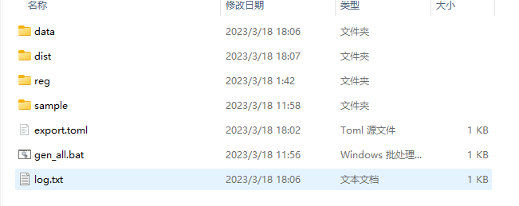
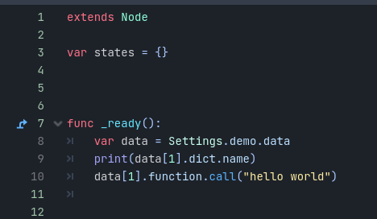

# 入门

## 环境要求

* Python:^3.8.1
* 操作系统: Windows (xlwings只支持Windows)
* Godot:^3.4

## 安装
通过pip （建议）
```
pip install gd-excelexporter
```

或者直接去右边[release](https://github.com/kaluluosi/GDExcelExporter/releases)里下载已经打包好的可执行文件（ee.exe，你需要将这个exe加到环境变量）。


!!! note
    2.1.4 版本开始exe的打包问题已经解决，后续版本会继续提供`ee.exe`命令行程序。


## 创建配置表项目

打开你的Godot游戏项目，项目根目录下右键打开命令行（此处打开powershell）
  
  
  
  

* data —— 存放你的excel文件
* dist —— 导出后数据文件存放目录
* reg —— 里面有一些reg脚本可以增加右键菜单方便导出
* sample —— 里面有excel示例表格
* export.toml —— 导出配置，定义了`ee`要怎么导出
* gen_all.bat —— 里面就一行代码`ee gen-all`，主要用于快速导出所有表格不用打开命令行
* gen_pot.bat —— 提取整个项目多语言文本（将来补充教程）


## 尝试配置并导出你第一份数据文件

  

!!! note
    当你需要创建新的excel表格的时候可以直接复制`sample`目录下的示例.xlsx文件，然后修改文件名即可。


## 在游戏中读取

首先你需要将`Setting\dist\settings.gd`添加到项目`autoload`。

  
  

通过查看`settings.gd`你就知道这个文件是用来统一管理数据源的。这样你就不需要每次想读取数据的时候又要加载数据和解析。

  

然后你就可以像下面一样读取数据

  

  

